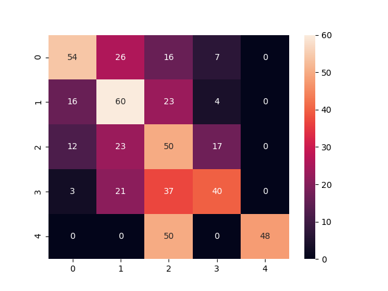

# A convolutional neural network written in Pytorch that labels images trained on a custom Dataset

## Goal of the network
To identify the number of individuals in an image. To understand Pytorch and understand ways of improving a network with a custom dataset.


## Network Architecture

The network architecture is loosely based on VGG16.

```python
self.conv = nn.Conv2d(3, 64, kernel_size=3)
self.conv2 = nn.Conv2d(64, 64, kernel_size=3)
self.pool = nn.MaxPool2d(kernel_size=2, stride=2)

self.conv3 = nn.Conv2d(64, 128, kernel_size=3)
self.conv4 = nn.Conv2d(128, 128, kernel_size=3)
self.pool2 = nn.MaxPool2d(kernel_size=2, stride=2)

self.conv5 = nn.Conv2d(128, 256, kernel_size=3)
self.conv6 = nn.Conv2d(256, 256, kernel_size=3)
self.pool3 = nn.MaxPool2d(kernel_size=2, stride=2)

self.fc1 = nn.Linear(4096, 4096)
self.fc2 = nn.Linear(4096, 4096)
self.out = nn.Linear(4096, num_classes)
```
## Training

The network was trained over 375 epochs, with a batch size of 15, learning rate of 0.001 and momentum of 0.9.

### Class distribution
```
Classes:
    One: 1126,
    Two: 1441,
    Three: 1382,
    Four: 589,
    Five or more: 19,
```
Clearly this is an imbalanced dataset, in order to overcome this WeightedRandomSampler() was used.

### Performance
```
              precision    recall  f1-score   support

           0       0.64      0.52      0.57       103
           1       0.46      0.58      0.52       103
           2       0.28      0.49      0.36       102
           3       0.59      0.40      0.47       101
           4       1.00      0.49      0.66        98

    accuracy                           0.50       507
   macro avg       0.59      0.50      0.52       507
weighted avg       0.59      0.50      0.52       507

```
50% accuracy on the test set is not bad considering the model is training on a small imbalanced dataset (4557 total) with high variance between images. I'm sure given enough data the network will be able to reach a higher accuracy.

### The resulting Confusion matrix



## Images

### Data acquisition
Scrapy web scraper pulled images from multiple sites. The images were hand labeled and modified with a center crop and resized to be 256x256. During training images are downsampled to be 64x64.

### Image Augmentation 

Albumentations was used to modify the images before being trained on the network. Flips and changing the image's colors may help the network generalize better.

```python
transform = A.Compose(
    [
        A.Resize(64, 64),
        A.HorizontalFlip(p=0.5),
        A.RandomRotate90(p=0.5),
        A.VerticalFlip(p=0.5),
        A.ToGray(p=0.2),
        A.Normalize(),
        ToTensorV2(),
    ]
)
```